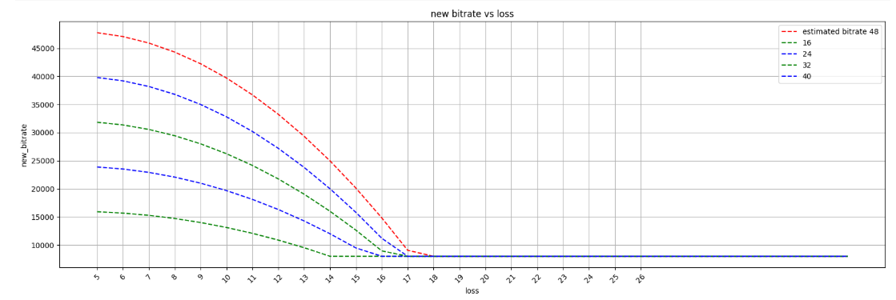
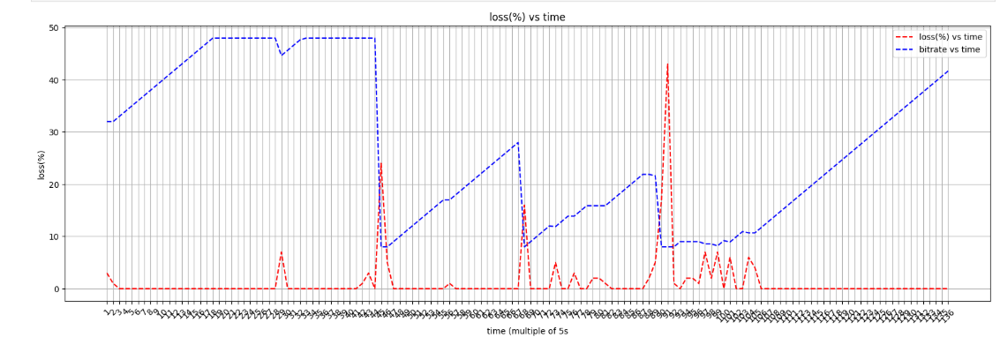

# FastAdapt: Real-Time Bitrate Adaptation Based on Network Conditions

## Table of Contents

1. [Introduction](#introduction)  
2. [Goal](#goal)  
3. [Overview of Dynamically Bitrate Adjustment Process](#overview-of-dynamically-bitrate-adjustment-process)  
4. [RTCP Packet Structure](#rtcp-packet-structure)  
   - [Audio Loss RTCP Packet](#audio-loss-rtcp-packet)  
   - [Encoding Lost Packet Statistics](#encoding-lost-packet-statistics)  
5. [Loss-based Bandwidth Adjustment Algorithm](#loss-based-bandwidth-adjustment-algorithm)  
6. [Real-time Simulation](#real-time-simulation)  
7. [Audio RTT RTCP Packet](#audio-rtt-rtcp-packet)  
   - [RTT Packet Structure](#audio-rtt-rtcp-packet)  
   - [Formula for RTT Calculation](#formula-for-rtt-calculation)  
8. [Resources](#resources)  


## Introduction
In real-time communication, network conditions are highly unpredictable. During an audio call, network conditions can fluctuate heavily, and therefore, audio packet loss can occur when bandwidth becomes low. Dynamically adjusting the bitrate can help in reducing the problem of packet loss by lowering the bitrate when network conditions deteriorate and increasing the bitrate when network conditions improve.

## Goal
In this article, we will learn how to dynamically adjust the bitrate based on Real-time Control Protocol (RTCP) feedback from the server. We will particularly focus on Audio Packet Loss ``RTCP`` feedback messages for deciding on bitrate adjustment on the client end using the ``Opus codec``.

Opus is a low-latency, adaptive bitrate audio codec that has control parameters for adjusting bitrate at runtime. However, Opus does not measure network conditions on its own. That's why we have to measure the network conditions using the RTCP feedback messages and change the parameters of the Opus codec based on our requirements for ``adjusting to our desired bitrate``.

## Overview of Dynamically Bitrate Adjustment Process
We will understand the scenario of dynamically adjusting the bitrate with a simple example. Let's say a client application is encoding audio data after capturing ``20 ms`` of audio. The encoded audios are sent to the server continuously. The server is receiving the audio frames and storing them in a queue. After every ``1 second``, the server notes which packets are lost and which are received successfully and prepares a ``packet loss statistics RTCP feedback`` packet. The RTCP packet is sent to the client. The client receives these RTCP feedback messages and, after every ``3 seconds``, measures the average packet loss percentage. Based on the packet loss percentage, the bitrate is updated on the client end to cope with the network conditions. 

# RTCP Packet Structure

## Audio Loss RTCP Packet
We know that, after the ``1 second`` interval, the server pops all the encoded audio frames from the queue and prepares the Audio Loss RTCP Packet. Let's learn about the structure of this RTCP packet where the encoded audio data has a duration of ``20 ms``.

                                   0                   1                   2                   3
                                   0 1 2 3 4 5 6 7 8 9 0 1 2 3 4 5 6 7 8 9 0 1 2 3 4 5 6 7 8 9 0 1
                                   +-+-+-+-+-+-+-+-+-+-+-+-+-+-+-+-+-+-+-+-+-+-+-+-+-+-+-+-+-+-+-+-+
                                   |       PT      |              BSN              |         PSC    
                                   +-+-+-+-+-+-+-+-+-+-+-+-+-+-+-+-+-+-+-+-+-+-+-+-+-+-+-+-+-+-+-+-+
                                                   |               
                                   +-+-+-+-+-+-+-+-+-+-+-+-+-+-+-+-+-+-+-+-+-+-+-+-+-+-+-+-+-+-+-+-+
                                                                  PS                  
                                   +-+-+-+-+-+-+-+-+-+-+-+-+-+-+-+-+-+-+-+-+-+-+-+-+-+-+-+-+-+-+-+-+
                                                                                    
                                   +-+-+-+-+-+-+-+-+-+-+-+-+-+-+-+-+-+-+-+-+-+-+-+-+-+-+-+-+-+-+-+-+
                                                                   |             RT                
                                   +-+-+-+-+-+-+-+-+-+-+-+-+-+-+-+-+-+-+-+-+-+-+-+-+-+-+-+-+-+-+-+-+
                                                                                          
                                   +-+-+-+-+-+-+-+-+-+-+-+-+-+-+-+-+-+-+-+-+-+-+-+-+-+-+-+-+-+-+-+-+
                                                                   |             FPC               |                         
                                   +-+-+-+-+-+-+-+-+-+-+-+-+-+-+-+-+-+-+-+-+-+-+-+-+-+-+-+-+-+-+-+-+
                                   |              ABT              |                                                                       
                                   +-+-+-+-+-+-+-+-+-+-+-+-+-+-+-+-+-+-+-+-+-+-+-+-+-+-+-+-+-+-+-+-+

                                   
                                   
Now, let's learn about the fields of the Audio Loss RTCP packet in detail.

**PT**:<br> 
Packet Type (``1 byte/ 8 bits``). For audio loss RTCP packet value is set to ``0``.<br>

**BSN**:<br>
Base Sequence Number (``2 bytes/ 16 bits``). We know that after every ``1s`` the queue's data is emptied and the statistics are calculated. BSN represents the sequence number of the ``first audio packet`` in the ``queue``.<br>

**PSC**:<br>
Packet Status Count (``2 bytes/ 16 bits``). Represents the total number of packets for which the ``received/lost``status is encoded.<br>

**PS**:<br>
Packet Status (``13 bytes/ 104 bits``). This is the size of the array where packet status will be encoded. This value is not fixed, though. It depends on the duration of the encoded audio frame. The following formula is used for measuring this size.<br>

```java
amountOfTimeForStoringPacketStatusMs = 2000
processingTimeMs = 20 // 40, 60, 80

public int getPacketStatusByteArraySize() {
    return (int) Math.ceil(amountOfTimeForStoringPacketStatusMs / (processingTimeMs * 8.0));
}
```
Note: Here, based on the processing time of every audio frame, the value of PS can be different. ``amountOfTimeForStoringPacketStatusMs`` represents that at max we will define the size of the array to hold 2s of audio packet loss status.<br>

**RT**:<br>
Reference time (``8 bytes/ 64 bits``). Sending timestamp of the audio loss RTCP packet.<br>

**FPC**:<br>
Feedback Packet Count (``2 bytes/ 16 bits``). This represents the sequence number of the feedback packets/ audio loss RTCP packet.<br>

**ABT**:<br>
Acknowledged bitrate (``2 bytes/ 16 bits``). The bitrate at which the server receives the encoded audio packets is represented by ABT.<br>

Note: In total, for transmission of encoded audio frames with a duration of ``20 ms``, the size of the audio loss RTCP packet is ``30 bytes``. 

## Encoding Lost Packet Statistics
We followed the procedure mentioned in Transport Wide Congestion Control Protocol (TWCCP) to encode the audio packet status. Every audio frame is mapped to a bit of a byte array, and that bit is set to ``1`` when the audio packet is received successfully; otherwise, that is set to ``0``. The algorithm for encoding audio packet status is provided below.

```java

  for (int i = 0; i < packetStatusCount; i++) {
      rtpFrame = frameForGeneratingRtcpQueue.take();
      int relativeDistance = rtpFrame.sequenceNumber - baseSequenceNumber;

      if (relativeDistance < 0 || relativeDistance >= packetStatusCount) {
          continue;
      }

      int byteIndex = relativeDistance / 8;
      int bitIndex = relativeDistance % 8;
      frame.packetStatus[byteIndex] |= (1 << bitIndex);
  }

```


## Loss-based Bandwidth Adjustment Algorithm
After receiving a packet loss RTCP packet from the server, the packet loss percentage is calculated, and after every three seconds, these losses are averaged. Based on the loss percentage bitrate is adjusted.
The following formula is used for finding the appropriate bitrate given a loss percentage.

```java
int newBitRate = (int) (((1 - 48 * Math.pow((acknowledgedLossRatio - 0.04), 2)) * currentBitRate));
```

Here, ``acknowledgedLossRatio`` represents the average loss ratio, and ``currentBitRate`` represents the current bitrate of the encoder. The following formula shows the relationship between the bitrate and loss ratio based on our formula.

<p align="center">
    
</p>

**Algorithm**<br>
The algorithm developed for adjusting bitrate dynamically is provided below. 

```java
    public void adjustBitRate() {

        int lossPercentage = (int) (acknowledgedLossRatio * 100);
        if (lossPercentage <= 0) {
            // Increase bitrate
            int newBitRate = (int) (((currentBitRate / (bitRateAdjustmentFactor * 1.0)) + 1) * bitRateAdjustmentFactor);
            if (newBitRate > maximumBitRate) {
                newBitRate = maximumBitRate;
            }

            currentBitRate = newBitRate;
            AudioConfigurations.getInstance().setBitRate(currentBitRate);
        } else if (lossPercentage >= 1 && lossPercentage <= 4) {

        } else {
            // Decrease bitrate
            int newBitRate = (int) (((1 - 48 * Math.pow((acknowledgedLossRatio - 0.04), 2)) * currentBitRate));
            if (!AudioConfigurations.getInstance().getIsAudioDebug()) {
                logger.info("newBitRate={}", newBitRate);
            }

            currentBitRate = Math.max(minimumBitRate, newBitRate);
            AudioConfigurations.getInstance().setBitRate(currentBitRate);
        }
    }
```

Here,<br>
``bitRateAdjustmentFactor`` is the bitrate adjustment factor: 1000 kbps<br>
``minimumBitRate`` is the minimum bitrate: 8000 kbps<br>
``maximumBitRate`` is the maximum bitrate: 48000 kbps<br>

Note: At first, the encoder starts with a bitrate of 32 kbps and later adjusts that based on network conditions.

**Thresholds**
Our experiments reveal that it is not optimal to change the bitrate every time only after calculating the loss percentage. Rather, we defined some thresholds of loss percentage so as not to change the bitrate every time for each value of loss percentage. Here are our thresholds<br>
* If the average loss percentage is 0, then we increase the bitrate by 1000 kbps.
* If the average loss is 1-4%, we do not update the bitrate.
* Otherwise, we changed the bitrate based on our formula mentioned earlier.

## Real-time Simulation
We carried out extensive simulations to test our approach to bitrate adjustment. We change the bandwidth from normal condition to 10, 8, 6, 4, and 80 KBps using the Clumsy tool and get the following results shown in the image below.
<p align="center">
    
</p>

These results show that our approach can dynamically adjust the bitrate based on network conditions.

## Audio RTT RTCP Packet
Though we are currently not using Round Trip Time (RTT) for adjusting bitrate, we sent RTT packets from the client to the server every 1-second interval. This can be used in the future. Here is the structure of the audio RTT RTCP packet.

                                   0                   1                   2                   3
                                   0 1 2 3 4 5 6 7 8 9 0 1 2 3 4 5 6 7 8 9 0 1 2 3 4 5 6 7 8 9 0 1
                                   +-+-+-+-+-+-+-+-+-+-+-+-+-+-+-+-+-+-+-+-+-+-+-+-+-+-+-+-+-+-+-+-+
                                   |       PT      |              SN               |             
                                   +-+-+-+-+-+-+-+-+-+-+-+-+-+-+-+-+-+-+-+-+-+-+-+-+-+-+-+-+-+-+-+-+
                                                                ST  
                                   +-+-+-+-+-+-+-+-+-+-+-+-+-+-+-+-+-+-+-+-+-+-+-+-+-+-+-+-+-+-+-+-+
                                                                                   | 
                                   +-+-+-+-+-+-+-+-+-+-+-+-+-+-+-+-+-+-+-+-+-+-+-+-+-+-+-+-+-+-+-+-+
                                   
                                   
Now, let's learn about the fields of the Audio RTT RTCP packet in detail.

**PT**:<br> 
Packet Type (``1 byte/ 8 bits``). For audio RTT RTCP packet value is set to ``1``.<br>

**SN**:<br>
Sequence Number (``2 bytes/ 16 bits``). Sequence number of the RTT packet.<br>

**ST**:<br>
Sending time (``8 bytes/ 64 bits``). Sending timestamp of the audio RTT RTCP packet.<br>

## Formula for RTT Calculation
We show that the client application sends an RTT packet. When the server receives this packet, it just sends it back to the client. When the client receives this packet, it subtracts the current time stamp from the send time stamp present in that packet and calculates the RTT.

```java
long rtt = System.currentTimeMillis() - sendTimestamp;
```

## Resources
Follow these resources to learn more about loss-based bandwidth estimation.

* [Loss based bandwidth estimation in WebRTC](https://medium.com/@ggarciabernardo/loss-based-bandwidth-estimation-in-webrtc-8d650f72bb42)  
* [Optimizing RTC bandwidth estimation with machine learning](https://engineering.fb.com/2024/03/20/networking-traffic/optimizing-rtc-bandwidth-estimation-machine-learning/)
* [Transport-wide Congestion Control](https://datatracker.ietf.org/doc/html/draft-holmer-rmcat-transport-wide-cc-extensions-01)
* [ A Google Congestion Control Algorithm for Real-Time Communication](https://datatracker.ietf.org/doc/html/draft-ietf-rmcat-gcc-02)
* [WebRTC For The Curious](https://webrtcforthecurious.com/)
* [Clumsy Tool for Network simulation](https://jagt.github.io/clumsy/)
---

**Prepared by**<br>
*Jakir Hasan (Reve Systems'25)*<br>
*Date (creation) - 29/06/25*<br>
*Date (last modification) - 29/06/25*<br>

